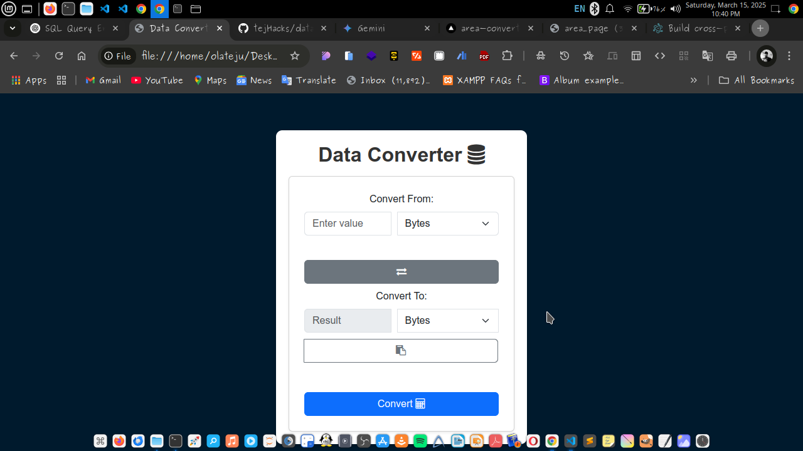

# Data Converter

## Overview
The **Data Converter** is a web-based tool that allows users to convert between different units of digital data, such as **Bytes, Kilobytes, Megabytes, Gigabytes, and Terabytes**. It provides a simple and intuitive interface for quick and accurate conversions.

## Features
- Convert between **Bytes (B), Kilobytes (KB), Megabytes (MB), Gigabytes (GB), and Terabytes (TB)**.
- **Real-time conversion** as you type.
- **Swap functionality** to easily switch between input and output units.
- **Copy feature** to quickly copy the converted value.
- **Responsive design** for seamless use on different devices.

## Technologies Used
- **HTML5**
- **CSS3 (Bootstrap 5 for styling)**
- **JavaScript (for conversion logic)**

## How to Use
1. **Enter a value** in the input field.
2. **Select the unit** you are converting from.
3. **Select the unit** you want to convert to.
4. Click **Convert** to see the result.
5. Use the **Swap** button to reverse the conversion.
6. Click the **Copy** button to copy the result.

## Screenshot

## Deployment
To deploy the project:
1. Clone the repository.
2. Open `index.html` in a browser.
3. Ensure all dependencies (Bootstrap, FontAwesome) are included.

Alternatively, you can deploy it on **GitHub Pages, Netlify, or Vercel** for easy access.

## Contributing
Feel free to fork this project, submit PRs, or suggest improvements! 🚀

